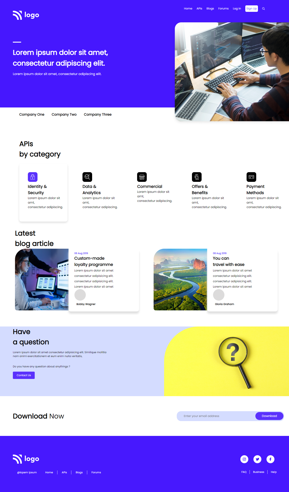

# Punit Maheshwari

# Landing Page

## Description

> This is a simple landing page with three section one is header with navigaation bar, second secord is related to the card boxes and last section is related to the footer where we can link all the social links and other links as web

# Learning in this project

> My big learning in this project is handle the design in parts. Don't need to scared from the long and big raw code. Once you started in parts this will be as simple as small designs

# Time Taken

> It took 4 hrs to complete this design

# Screenshot

